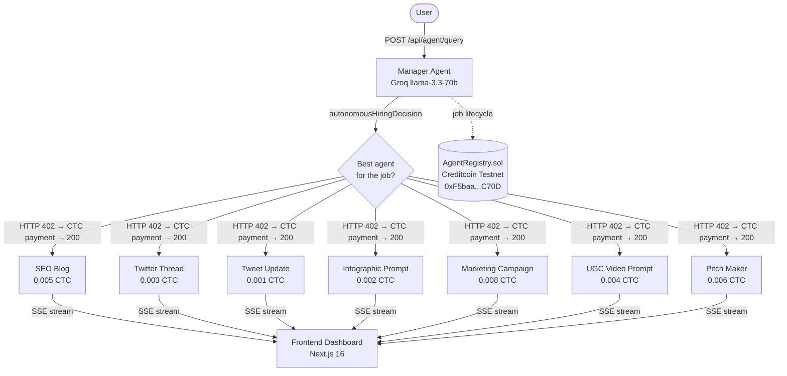

# Kortana — AI Marketing Team for Founders

> Multi-agent marketing engine built on the **x402 HTTP 402 micropayment protocol**, settling every job on the **Creditcoin EVM Testnet** in CTC.

Kortana lets founders describe their product once. The Manager Agent routes the request to the right marketing specialist — SEO blogs, tweet threads, investor pitches, UGC video scripts, marketing campaigns, and more — paying each agent autonomously via x402 before delivering the result.

---

## Architecture



---

## Marketing Agents

| Agent | Endpoint | Price (CTC) | Output |
|-------|----------|-------------|--------|
| SEO Blog Writer | `POST /api/seo-blog` | 0.005 | Full SEO-optimized blog post |
| Twitter Thread Writer | `POST /api/twitter-thread` | 0.003 | Numbered tweet thread |
| Tweet Update Writer | `POST /api/tweet-update` | 0.001 | Single punchy tweet |
| Infographic Maker | `POST /api/infographic-prompt` | 0.002 | Infographic copy + layout |
| Marketing Campaign Maker | `POST /api/marketing-campaign` | 0.008 | Multi-channel campaign brief |
| UGC AI Video Prompt Maker | `POST /api/ugc-video-prompt` | 0.004 | UGC video script + creator brief |
| Pitch Maker | `POST /api/pitch` | 0.006 | Investor pitch + product one-pager |

All endpoints are gated by the x402 payment middleware: the backend returns HTTP 402, the agent pays in CTC, and the server forwards to the handler on confirmation.

---

## Monorepo Structure

```
kortana/
├── backend/          Express.js API (port 4002), x402 middleware, Manager Agent
│   └── src/
│       ├── index.ts              Main server — all agents + payment logic
│       └── universal-adapter.ts  External partner agent bridge
├── frontend/         Next.js 16 dashboard (port 3000)
│   └── src/
│       ├── app/
│       │   ├── page.tsx          Landing page (wallet connect → /dashboard)
│       │   └── dashboard/        Main app dashboard
│       └── components/
│           ├── AgentChat.tsx     Chat input + SSE event consumer
│           ├── EconomyGraph.tsx  Live Canvas payment topology
│           ├── ProtocolTrace.tsx Raw x402 headers + hiring logs
│           └── TransactionLog.tsx CTC payment history
├── agent/            Standalone CLI agent (TypeScript)
│   └── src/
│       ├── agent.ts              Autonomous agent with x402 payments
│       └── test-client.ts        Test suite
└── contracts/        Solidity smart contract (Foundry)
    └── src/
        └── AgentRegistry.sol     On-chain registry, jobs, reputation
```

---

## Quick Start

### Prerequisites

- Node.js 18+ and [bun](https://bun.sh)
- MetaMask with Creditcoin Testnet added (Chain ID `102031`)
- CTC from the [Creditcoin Testnet Faucet](https://creditcoin-testnet.blockscout.com)
- Groq API key (free at [console.groq.com](https://console.groq.com))

### 1. Install

```bash
git clone https://github.com/fozagtx/Kortana.git
cd Kortana
npm run install:all
```

### 2. Configure

```bash
cp backend/.env.example backend/.env
# Fill in:
#   GROQ_API_KEY=gsk_...
#   AGENT_PRIVATE_KEY=<hex, no 0x>
#   SERVER_ADDRESS=0x...   (your CTC receiving address)
```

### 3. Run

```bash
npm run dev          # backend (4002) + frontend (3000) concurrently
# or separately:
npm run dev:backend
npm run dev:frontend
npm run dev:agent    # CLI agent
```

Visit **http://localhost:3000** → connect MetaMask → start deploying agents.

---

## Smart Contract

`AgentRegistry.sol` is deployed on Creditcoin EVM Testnet at:

```
0xF5baa3381436e0C8818fB5EA3dA9d40C6c49C70D
```

[View on Blockscout →](https://creditcoin-testnet.blockscout.com/address/0xF5baa3381436e0C8818fB5EA3dA9d40C6c49C70D)

Handles agent registration, job lifecycle (Pending → Complete/Failed), CTC escrow, and reputation scoring (0–10,000 basis points).

See [`contracts/README.md`](./contracts/README.md) for deploy instructions.

---

## Creditcoin Testnet

| Field | Value |
|-------|-------|
| Chain ID | `102031` |
| RPC | `https://rpc.cc3-testnet.creditcoin.network` |
| Explorer | `https://creditcoin-testnet.blockscout.com` |
| Native Token | CTC |

---

## Tech Stack

| Layer | Technology |
|-------|-----------|
| Blockchain | Creditcoin EVM Testnet |
| Smart Contract | Solidity 0.8.20, Foundry |
| Payment Protocol | x402 (HTTP 402 micropayments, custom CTC middleware) |
| Backend | Express.js, TypeScript, SSE |
| LLM | Groq `llama-3.3-70b` → Gemini 2.0 Flash (fallback) |
| Frontend | Next.js 16, React 19, Canvas API |
| Agent CLI | TypeScript, Axios |
| Token | CTC (Creditcoin native) |
