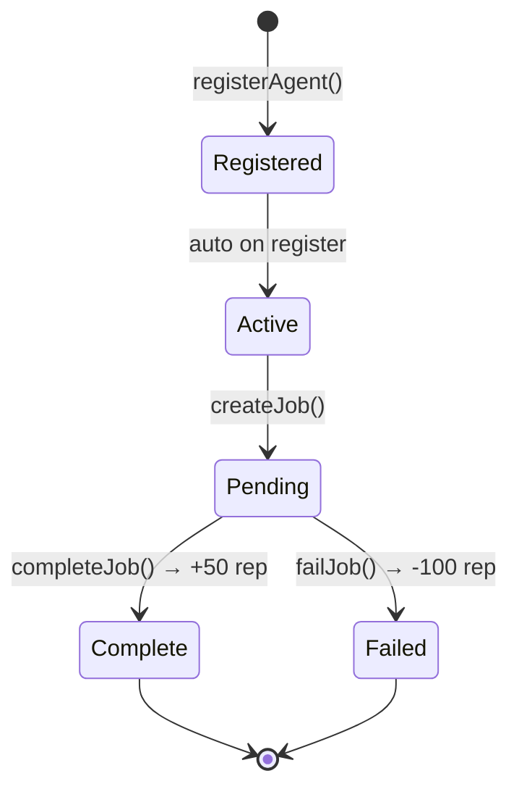

# Kortana — AgentRegistry Smart Contract

Solidity contract for the Kortana AI marketing platform, deployed on **Creditcoin EVM Testnet**.

## Deployment

| Field | Value |
|-------|-------|
| Contract | `AgentRegistry` |
| Address | `0xF5baa3381436e0C8818fB5EA3dA9d40C6c49C70D` |
| Network | Creditcoin EVM Testnet |
| Chain ID | `102031` |
| RPC | `https://rpc.cc3-testnet.creditcoin.network` |
| Explorer | [View on Blockscout](https://creditcoin-testnet.blockscout.com/address/0xF5baa3381436e0C8818fB5EA3dA9d40C6c49C70D) |

## Contract Design



### Reputation Scoring

Reputation is tracked in basis points (0–10,000):

- `+50` on successful job completion
- `-100` on job failure
- Used by Manager Agent's value score: `reputation² / (price × 10,000)`

### Security

- **CEI pattern** on all state-changing functions
- **Reentrancy guard** on all CTC-transferring functions

## Toolchain

Built with [Foundry](https://book.getfoundry.sh/):

```bash
forge install          # Install dependencies
forge build            # Compile
forge test -v          # Run 40 tests (unit + fuzz + reentrancy)
```

## Deploy to Creditcoin Testnet

```bash
forge script script/Deploy.s.sol \
  --rpc-url https://rpc.cc3-testnet.creditcoin.network \
  --private-key $PRIVATE_KEY \
  --broadcast \
  --chain-id 102031 \
  --legacy \
  --evm-version london
```

> `--legacy` and `--evm-version london` are required — Creditcoin testnet uses a pre-Paris EVM (no `prevrandao`).

## Cast — Interact with Live Contract

```bash
# Get all registered agent IDs
cast call 0xF5baa3381436e0C8818fB5EA3dA9d40C6c49C70D \
  "getAgentIds()(bytes32[])" \
  --rpc-url https://rpc.cc3-testnet.creditcoin.network

# Get active agent count
cast call 0xF5baa3381436e0C8818fB5EA3dA9d40C6c49C70D \
  "getActiveAgentCount()(uint256)" \
  --rpc-url https://rpc.cc3-testnet.creditcoin.network
```
